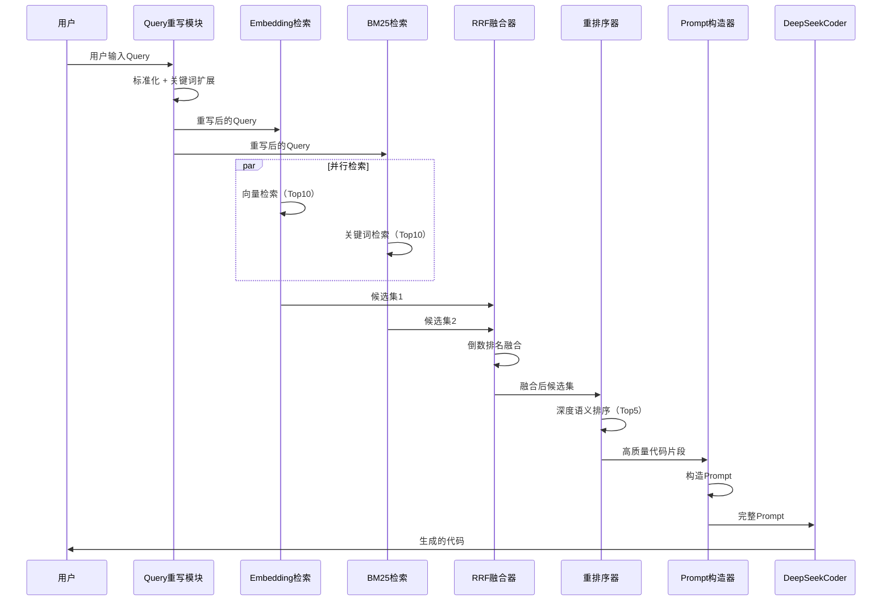
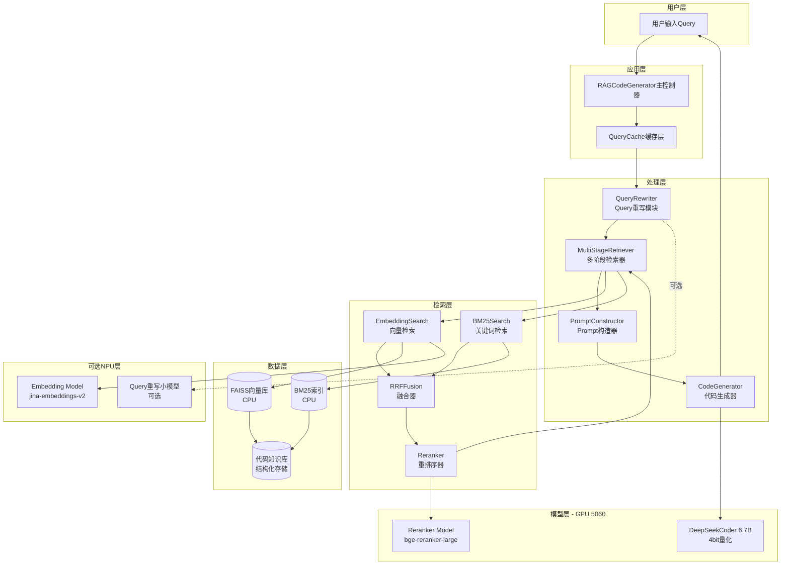
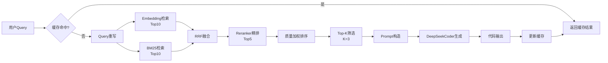
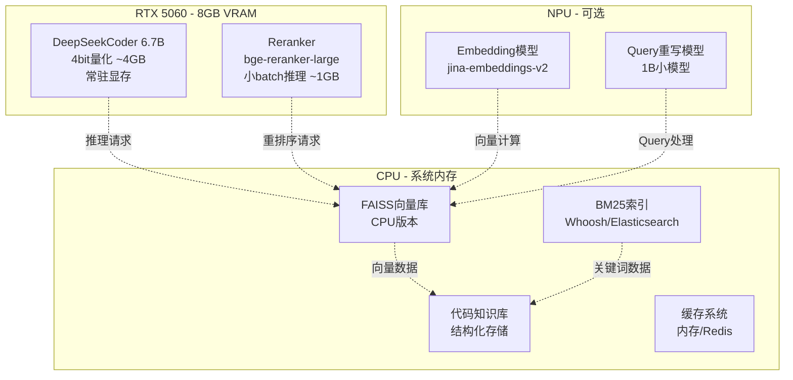
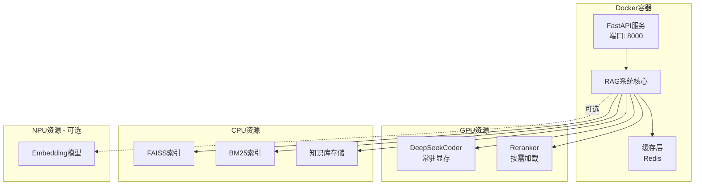

# 设计文档：RAG代码生成系统

## 概述

本系统是一个基于检索增强生成（RAG）的高质量代码生成系统，目标是在单机环境（NPU + RTX 5060）下实现输出质量最大化。系统核心策略是不训练模型，而是构建智能的多阶段检索系统，通过高质量代码知识库、Query理解、多路检索融合、重排序和质量评分等模块，为DeepSeekCoder 6.7B主模型提供最优上下文，从而生成高质量代码。

系统采用"计算前移"策略，将embedding计算、summary生成、质量评分等重计算任务放在离线阶段完成，在线阶段仅执行轻量的检索、排序和生成任务，确保单机环境下的稳定运行。

## 主要算法/工作流



## 核心接口/类型

```python
from typing import List, Dict, Optional, Tuple
from dataclasses import dataclass
from enum import Enum

@dataclass
class CodeSnippet:
    """代码片段数据结构"""
    code: str
    summary: str
    imports: str
    path: str
    language: str
    tags: List[str]
    quality_score: float
    stars: int
    last_update: str
    embedding: Optional[List[float]] = None

@dataclass
class QueryContext:
    """Query上下文"""
    original_query: str
    rewritten_query: str
    expanded_keywords: List[str]
    language_hint: Optional[str] = None

@dataclass
class RetrievalResult:
    """检索结果"""
    snippet: CodeSnippet
    score: float
    source: str  # "embedding", "bm25", "reranker"

class DeviceType(Enum):
    """设备类型"""
    GPU_5060 = "cuda:0"
    NPU = "npu"
    CPU = "cpu"

## 关键函数与形式化规范

### 函数1: rewrite_query()

```python
def rewrite_query(query: str) -> QueryContext:
    """
    Query重写与扩展
    
    Args:
        query: 用户原始输入
        
    Returns:
        QueryContext: 包含重写后query和扩展关键词
    """
    pass
```

**前置条件：**
- `query` 非空字符串
- `query.strip()` 长度 > 0

**后置条件：**
- 返回有效的 `QueryContext` 对象
- `rewritten_query` 是标准化的英文描述
- `expanded_keywords` 包含至少1个关键词
- 不修改输入参数 `query`

**循环不变式：** N/A（无循环）

---

### 函数2: multi_stage_retrieval()

```python
def multi_stage_retrieval(
    query_ctx: QueryContext,
    top_k: int = 5
) -> List[RetrievalResult]:
    """
    多阶段检索：Embedding + BM25 + RRF + Reranker
    
    Args:
        query_ctx: Query上下文
        top_k: 最终返回的代码片段数量
        
    Returns:
        排序后的检索结果列表
    """
    pass
```

**前置条件：**
- `query_ctx` 是有效的 `QueryContext` 对象
- `query_ctx.rewritten_query` 非空
- `top_k` 是正整数，且 `1 <= top_k <= 10`

**后置条件：**
- 返回列表长度 <= `top_k`
- 结果按 `score` 降序排列
- 所有结果的 `score` 在 [0, 1] 范围内
- 如果知识库为空，返回空列表

**循环不变式：**
- 在融合阶段：所有已处理的候选项都有有效的融合分数
- 在重排序阶段：所有已处理的候选项都有有效的reranker分数

---

### 函数3: construct_prompt()

```python
def construct_prompt(
    query: str,
    retrieved_snippets: List[RetrievalResult],
    max_tokens: int = 2000
) -> str:
    """
    构造最终的Prompt
    
    Args:
        query: 用户原始问题
        retrieved_snippets: 检索到的代码片段
        max_tokens: 最大token数限制
        
    Returns:
        完整的Prompt字符串
    """
    pass
```

**前置条件：**
- `query` 非空字符串
- `retrieved_snippets` 是有效列表（可为空）
- `max_tokens` > 500（确保有足够空间）

**后置条件：**
- 返回的Prompt字符串非空
- Prompt包含系统指令、参考代码和用户问题三部分
- 总token数 <= `max_tokens`
- 如果 `retrieved_snippets` 为空，仍返回有效Prompt（仅包含系统指令和用户问题）

**循环不变式：**
- 在拼接代码片段时：累计token数不超过预算
- 所有已添加的代码片段都包含code和summary

---

### 函数4: generate_code()

```python
def generate_code(
    prompt: str,
    model: Any,
    temperature: float = 0.2,
    max_new_tokens: int = 512
) -> str:
    """
    使用DeepSeekCoder生成代码
    
    Args:
        prompt: 完整的输入Prompt
        model: 加载的模型实例
        temperature: 生成温度
        max_new_tokens: 最大生成token数
        
    Returns:
        生成的代码字符串
    """
    pass
```

**前置条件：**
- `prompt` 非空字符串
- `model` 已正确加载到GPU
- `0 <= temperature <= 1.0`
- `max_new_tokens` > 0

**后置条件：**
- 返回生成的代码字符串（可能为空，如果生成失败）
- 不修改模型状态（无副作用）
- 生成的token数 <= `max_new_tokens`

**循环不变式：** N/A（模型内部处理）

## 算法伪代码

### 主处理算法

```python
def process_code_generation_request(user_query: str) -> str:
    """
    主处理流程：从用户输入到代码生成
    
    INPUT: user_query (用户输入的代码需求描述)
    OUTPUT: generated_code (生成的代码字符串)
    """
    # 前置条件检查
    assert user_query is not None and len(user_query.strip()) > 0
    
    # 步骤1: Query重写与理解
    query_ctx = rewrite_query(user_query)
    assert query_ctx.rewritten_query is not None
    
    # 步骤2: 多阶段检索
    retrieved_results = multi_stage_retrieval(query_ctx, top_k=3)
    
    # 步骤3: Prompt构造
    prompt = construct_prompt(
        query=user_query,
        retrieved_snippets=retrieved_results,
        max_tokens=2000
    )
    assert len(prompt) > 0
    
    # 步骤4: 代码生成
    generated_code = generate_code(
        prompt=prompt,
        model=global_model,
        temperature=0.2,
        max_new_tokens=512
    )
    
    # 后置条件检查
    assert isinstance(generated_code, str)
    
    return generated_code
```

**前置条件：**
- user_query 是非空字符串
- 全局模型 global_model 已加载
- 知识库已初始化

**后置条件：**
- 返回字符串类型的代码
- 不修改知识库状态
- 不修改模型权重

**循环不变式：** N/A（顺序执行）

---

### 多阶段检索算法

```python
def multi_stage_retrieval_algorithm(query_ctx: QueryContext, top_k: int) -> List[RetrievalResult]:
    """
    多阶段检索算法实现
    
    INPUT: query_ctx (Query上下文), top_k (返回数量)
    OUTPUT: results (排序后的检索结果)
    """
    # 前置条件
    assert query_ctx.rewritten_query is not None
    assert 1 <= top_k <= 10
    
    # 阶段1: 并行召回
    embedding_candidates = embedding_search(query_ctx.rewritten_query, top_n=10)
    bm25_candidates = bm25_search(query_ctx.rewritten_query, top_n=10)
    
    # 阶段2: RRF融合
    fused_candidates = []
    all_candidates = merge_candidates(embedding_candidates, bm25_candidates)
    
    for candidate in all_candidates:
        # 循环不变式：所有已处理候选项都有有效的RRF分数
        assert all(hasattr(c, 'rrf_score') for c in fused_candidates)
        
        rrf_score = compute_rrf_score(
            candidate,
            embedding_candidates,
            bm25_candidates,
            k=60
        )
        candidate.rrf_score = rrf_score
        fused_candidates.append(candidate)
    
    # 阶段3: Reranker精排
    reranked_results = []
    top_candidates = sorted(fused_candidates, key=lambda x: x.rrf_score, reverse=True)[:20]
    
    for candidate in top_candidates:
        # 循环不变式：所有已处理候选项都有reranker分数
        assert all(hasattr(r, 'rerank_score') for r in reranked_results)
        
        rerank_score = reranker.score(query_ctx.rewritten_query, candidate.snippet.code)
        candidate.rerank_score = rerank_score
        reranked_results.append(candidate)
    
    # 阶段4: 质量加权
    final_results = []
    for candidate in reranked_results:
        final_score = (
            0.4 * candidate.rerank_score +
            0.2 * candidate.embedding_score +
            0.15 * candidate.bm25_score +
            0.15 * candidate.snippet.quality_score / 10.0 +
            0.1 * min(candidate.snippet.stars / 10000, 1.0)
        )
        final_results.append(RetrievalResult(
            snippet=candidate.snippet,
            score=final_score,
            source="multi_stage"
        ))
    
    # 排序并返回Top-K
    final_results.sort(key=lambda x: x.score, reverse=True)
    results = final_results[:top_k]
    
    # 后置条件
    assert len(results) <= top_k
    assert all(0 <= r.score <= 1 for r in results)
    
    return results
```

**前置条件：**
- query_ctx 包含有效的重写后query
- top_k 在合理范围内 [1, 10]
- embedding模型和BM25索引已初始化
- reranker模型已加载

**后置条件：**
- 返回结果数量 <= top_k
- 所有结果按分数降序排列
- 所有分数在 [0, 1] 范围内

**循环不变式：**
- RRF融合阶段：所有已处理的候选项都有有效的RRF分数
- Reranker阶段：所有已处理的候选项都有reranker分数

### Query重写算法

```python
def query_rewrite_algorithm(query: str) -> QueryContext:
    """
    Query重写算法：标准化 + 关键词扩展
    
    INPUT: query (用户原始输入)
    OUTPUT: query_ctx (Query上下文)
    """
    # 前置条件
    assert query is not None and len(query.strip()) > 0
    
    # 步骤1: 标准化处理
    normalized = query.strip().lower()
    
    # 步骤2: 关键词映射与扩展
    keyword_map = {
        "数据库": ["database", "db", "sql", "connection pool"],
        "缓存": ["cache", "redis", "memcached"],
        "并发": ["async", "concurrent", "thread", "coroutine"],
        "api": ["api", "rest", "endpoint", "route"],
    }
    
    expanded_keywords = []
    for key, synonyms in keyword_map.items():
        if key in normalized:
            expanded_keywords.extend(synonyms)
    
    # 步骤3: 构造重写后的query
    if expanded_keywords:
        rewritten = f"{query} ({' OR '.join(set(expanded_keywords))})"
    else:
        rewritten = query
    
    # 构造上下文
    query_ctx = QueryContext(
        original_query=query,
        rewritten_query=rewritten,
        expanded_keywords=list(set(expanded_keywords))
    )
    
    # 后置条件
    assert query_ctx.rewritten_query is not None
    assert len(query_ctx.expanded_keywords) >= 0
    
    return query_ctx
```

**前置条件：**
- query 是非空字符串

**后置条件：**
- 返回有效的 QueryContext 对象
- rewritten_query 非空
- expanded_keywords 是列表（可为空）

**循环不变式：**
- 在关键词扩展循环中：所有已添加的关键词都来自预定义映射表

---

### RRF融合算法

```python
def compute_rrf_score_algorithm(
    candidate: CodeSnippet,
    embedding_results: List[Tuple[CodeSnippet, float]],
    bm25_results: List[Tuple[CodeSnippet, float]],
    k: int = 60
) -> float:
    """
    倒数排名融合（Reciprocal Rank Fusion）算法
    
    INPUT: 
        candidate - 待评分的候选项
        embedding_results - Embedding检索结果（按分数排序）
        bm25_results - BM25检索结果（按分数排序）
        k - RRF平滑参数
    OUTPUT: 
        rrf_score - 融合后的分数
    """
    # 前置条件
    assert k > 0
    assert len(embedding_results) > 0 or len(bm25_results) > 0
    
    rrf_score = 0.0
    
    # 计算在embedding结果中的排名
    for rank, (snippet, score) in enumerate(embedding_results, start=1):
        if snippet.path == candidate.path:
            rrf_score += 1.0 / (k + rank)
            break
    
    # 计算在BM25结果中的排名
    for rank, (snippet, score) in enumerate(bm25_results, start=1):
        if snippet.path == candidate.path:
            rrf_score += 1.0 / (k + rank)
            break
    
    # 后置条件
    assert rrf_score >= 0
    
    return rrf_score
```

**前置条件：**
- k 是正整数
- 至少一个结果列表非空
- 结果列表已按分数排序

**后置条件：**
- 返回非负浮点数
- 如果候选项在两个列表中都出现，分数更高

**循环不变式：**
- 在遍历结果列表时：rrf_score 单调递增或保持不变

## 示例用法

```python
# 示例1: 基本使用流程
from rag_code_generator import RAGCodeGenerator

# 初始化系统
generator = RAGCodeGenerator(
    model_path="deepseek-coder-6.7b-instruct",
    device="cuda:0",
    quantization="4bit"
)

# 用户输入
user_query = "如何实现一个线程安全的数据库连接池？"

# 生成代码
generated_code = generator.generate(user_query)
print(generated_code)

# 示例2: 带缓存的使用
from rag_code_generator import RAGCodeGenerator
from rag_code_generator.cache import QueryCache

# 初始化缓存
cache = QueryCache(max_size=1000)
generator = RAGCodeGenerator(
    model_path="deepseek-coder-6.7b-instruct",
    device="cuda:0",
    cache=cache
)

# 第一次查询（会执行完整流程）
result1 = generator.generate("实现Redis缓存装饰器")

# 第二次相同查询（直接从缓存返回）
result2 = generator.generate("实现Redis缓存装饰器")
assert result1 == result2

# 示例3: 完整工作流演示
from rag_code_generator.query_rewriter import QueryRewriter
from rag_code_generator.retrieval import MultiStageRetriever
from rag_code_generator.prompt import PromptConstructor
from rag_code_generator.generator import CodeGenerator

# 初始化各模块
rewriter = QueryRewriter()
retriever = MultiStageRetriever(
    embedding_model="jina-embeddings-v2-base-code",
    bm25_index_path="./indexes/bm25",
    reranker_model="bge-reranker-large"
)
prompt_constructor = PromptConstructor(max_tokens=2000)
code_generator = CodeGenerator(
    model_path="deepseek-coder-6.7b-instruct",
    device="cuda:0"
)

# 执行完整流程
user_query = "实现一个异步HTTP客户端"

# 步骤1: Query重写
query_ctx = rewriter.rewrite(user_query)
print(f"重写后: {query_ctx.rewritten_query}")
print(f"扩展关键词: {query_ctx.expanded_keywords}")

# 步骤2: 多阶段检索
retrieved_results = retriever.retrieve(query_ctx, top_k=3)
for i, result in enumerate(retrieved_results, 1):
    print(f"结果{i}: {result.snippet.path} (分数: {result.score:.3f})")

# 步骤3: 构造Prompt
prompt = prompt_constructor.construct(user_query, retrieved_results)
print(f"Prompt长度: {len(prompt)} 字符")

# 步骤4: 生成代码
generated_code = code_generator.generate(prompt)
print("生成的代码:")
print(generated_code)

# 示例4: 错误处理
try:
    generator = RAGCodeGenerator(model_path="invalid-model")
except ValueError as e:
    print(f"模型加载失败: {e}")

try:
    result = generator.generate("")  # 空查询
except ValueError as e:
    print(f"无效输入: {e}")

# 示例5: 批量生成
queries = [
    "实现JWT认证中间件",
    "实现分布式锁",
    "实现消息队列消费者"
]

results = []
for query in queries:
    code = generator.generate(query)
    results.append({
        "query": query,
        "code": code
    })

for item in results:
    print(f"\n查询: {item['query']}")
    print(f"代码:\n{item['code'][:200]}...")  # 只显示前200字符
```

## 正确性属性

*属性是关于系统行为的形式化陈述，应该对所有有效输入都成立。属性作为人类可读规范和机器可验证正确性保证之间的桥梁。*

### 属性1：检索结果分数单调性

*对于任意*有效查询和top_k参数，多阶段检索返回的结果必须按分数严格降序排列

**验证需求：3.2**

### 属性2：检索结果数量约束

*对于任意*有效查询和top_k参数，多阶段检索返回的结果数量不得超过top_k

**验证需求：3.1**

### 属性3：检索结果分数范围

*对于任意*检索结果，其分数必须在0到1的闭区间内

**验证需求：3.3**

### 属性4：Token预算约束

*对于任意*用户查询、检索结果列表和最大token限制，构造的Prompt的总token数不得超过配置的最大值

**验证需求：4.2**

### 属性5：Prompt结构完整性

*对于任意*用户查询和检索结果列表（可为空），构造的Prompt必须包含系统指令部分和用户问题部分，当检索结果非空时还必须包含参考代码部分

**验证需求：4.1**

### 属性6：缓存一致性

*对于任意*查询，在缓存有效期内，对相同查询的多次调用必须返回完全相同的结果

**验证需求：6.1, 6.2**

### 属性7：输入验证

*对于任意*空字符串或仅包含空白字符的输入，系统必须拒绝该请求并抛出ValueError异常

**验证需求：1.2**

### 属性8：Query重写输出完整性

*对于任意*有效的非空查询，Query重写器必须返回包含原始查询、重写后查询和扩展关键词列表的QueryContext对象

**验证需求：1.4**

### 属性9：确定性生成

*对于任意*Prompt，当生成温度设置为0时，对相同Prompt的多次生成调用必须产生完全相同的输出

**验证需求：5.3**

### 属性10：生成token数量约束

*对于任意*Prompt和max_new_tokens配置，生成的代码的token数量不得超过max_new_tokens

**验证需求：5.2**

### 属性11：错误隔离性

*对于任意*请求序列，如果某个请求失败，系统必须保持可用状态并能够成功处理后续的有效请求

**验证需求：9.5**

### 属性12：输入清理

*对于任意*包含特殊字符（<, >, ", '）的用户输入，系统必须在处理前移除这些字符

**验证需求：10.1**

### 属性13：速率限制

*对于任意*用户，在60秒时间窗口内发送超过10个请求时，第11个及后续请求必须被拒绝并返回速率限制错误

**验证需求：10.4**

### 属性14：知识库质量门槛

*对于任意*待添加的代码片段，如果其质量分数低于5.0或GitHub stars低于100，知识库必须拒绝添加该片段

**验证需求：11.1, 11.2**

### 属性15：知识库索引一致性

*对于任意*成功添加到知识库的代码片段，该片段必须能够通过向量检索和关键词检索两种方式被检索到

**验证需求：11.5**

### 属性16：批量处理完整性

*对于任意*批量查询请求，返回的结果列表长度必须等于输入查询列表长度，即使某些查询失败也应返回错误标记

**验证需求：12.1, 12.4**

### 属性17：批量处理错误隔离

*对于任意*包含无效查询的批量请求，无效查询的失败不得影响其他有效查询的处理

**验证需求：12.3**

### 属性18：代码质量分数范围

*对于任意*代码片段，其质量分数必须在0到10的闭区间内

**验证需求：需求11中隐含**

### 属性19：API响应格式一致性

*对于任意*API请求，响应必须是有效的JSON格式，成功时包含生成的代码，失败时包含错误描述

**验证需求：15.2, 15.4**

## 系统架构

### 整体架构图



### 数据流图



### 资源分配图



## 组件与接口

### 组件1: RAGCodeGenerator（主控制器）

**职责：** 系统入口，协调各模块完成代码生成任务

**接口：**
```python
class RAGCodeGenerator:
    def __init__(
        self,
        model_path: str,
        device: str = "cuda:0",
        quantization: str = "4bit",
        cache: Optional[QueryCache] = None,
        config: Optional[Dict] = None
    ):
        """
        初始化RAG代码生成器
        
        Args:
            model_path: DeepSeekCoder模型路径
            device: 运行设备
            quantization: 量化方式（4bit/8bit）
            cache: 缓存实例
            config: 配置字典
        """
        pass
    
    def generate(
        self,
        query: str,
        top_k: int = 3,
        temperature: float = 0.2,
        max_new_tokens: int = 512
    ) -> str:
        """
        生成代码
        
        Args:
            query: 用户输入
            top_k: 检索代码片段数量
            temperature: 生成温度
            max_new_tokens: 最大生成token数
            
        Returns:
            生成的代码字符串
        """
        pass
    
    def batch_generate(
        self,
        queries: List[str],
        **kwargs
    ) -> List[str]:
        """批量生成代码"""
        pass
```

**职责清单：**
- 初始化所有子模块
- 管理模型生命周期
- 协调完整的生成流程
- 处理异常和错误恢复

---

### 组件2: QueryRewriter（Query重写模块）

**职责：** 理解和重写用户Query，扩展关键词

**接口：**
```python
class QueryRewriter:
    def __init__(
        self,
        use_model: bool = False,
        model_path: Optional[str] = None,
        device: str = "cpu"
    ):
        """
        初始化Query重写器
        
        Args:
            use_model: 是否使用模型（否则使用规则）
            model_path: 小模型路径（可选）
            device: 运行设备
        """
        pass
    
    def rewrite(self, query: str) -> QueryContext:
        """
        重写Query
        
        Args:
            query: 原始用户输入
            
        Returns:
            QueryContext对象
        """
        pass
    
    def expand_keywords(self, query: str) -> List[str]:
        """扩展关键词"""
        pass
```

**职责清单：**
- Query标准化（去噪、统一格式）
- 关键词扩展（同义词、相关词）
- 语言检测（可选）
- 意图识别（可选）

---

### 组件3: MultiStageRetriever（多阶段检索器）

**职责：** 执行多阶段检索流程

**接口：**
```python
class MultiStageRetriever:
    def __init__(
        self,
        embedding_model: str,
        bm25_index_path: str,
        reranker_model: str,
        faiss_index_path: str,
        device: str = "cuda:0"
    ):
        """
        初始化多阶段检索器
        
        Args:
            embedding_model: Embedding模型名称
            bm25_index_path: BM25索引路径
            reranker_model: Reranker模型名称
            faiss_index_path: FAISS索引路径
            device: Reranker运行设备
        """
        pass
    
    def retrieve(
        self,
        query_ctx: QueryContext,
        top_k: int = 5
    ) -> List[RetrievalResult]:
        """
        执行多阶段检索
        
        Args:
            query_ctx: Query上下文
            top_k: 最终返回数量
            
        Returns:
            排序后的检索结果
        """
        pass
    
    def embedding_search(
        self,
        query: str,
        top_n: int = 10
    ) -> List[Tuple[CodeSnippet, float]]:
        """Embedding向量检索"""
        pass
    
    def bm25_search(
        self,
        query: str,
        top_n: int = 10
    ) -> List[Tuple[CodeSnippet, float]]:
        """BM25关键词检索"""
        pass
    
    def rrf_fusion(
        self,
        embedding_results: List[Tuple[CodeSnippet, float]],
        bm25_results: List[Tuple[CodeSnippet, float]],
        k: int = 60
    ) -> List[Tuple[CodeSnippet, float]]:
        """RRF融合"""
        pass
    
    def rerank(
        self,
        query: str,
        candidates: List[CodeSnippet],
        top_k: int = 5
    ) -> List[Tuple[CodeSnippet, float]]:
        """Reranker重排序"""
        pass
```

**职责清单：**
- 管理Embedding检索
- 管理BM25检索
- 执行RRF融合
- 执行Reranker精排
- 质量加权排序

### 组件4: PromptConstructor（Prompt构造器）

**职责：** 构造高质量的Prompt

**接口：**
```python
class PromptConstructor:
    def __init__(
        self,
        max_tokens: int = 2000,
        template_path: Optional[str] = None
    ):
        """
        初始化Prompt构造器
        
        Args:
            max_tokens: 最大token限制
            template_path: 自定义模板路径
        """
        pass
    
    def construct(
        self,
        query: str,
        retrieved_snippets: List[RetrievalResult]
    ) -> str:
        """
        构造完整Prompt
        
        Args:
            query: 用户原始问题
            retrieved_snippets: 检索到的代码片段
            
        Returns:
            完整的Prompt字符串
        """
        pass
    
    def format_snippet(self, snippet: CodeSnippet) -> str:
        """格式化单个代码片段"""
        pass
    
    def count_tokens(self, text: str) -> int:
        """计算token数量"""
        pass
```

**职责清单：**
- 管理Prompt模板
- 格式化代码片段
- 控制token预算
- 添加系统指令和约束

---

### 组件5: CodeGenerator（代码生成器）

**职责：** 使用DeepSeekCoder生成代码

**接口：**
```python
class CodeGenerator:
    def __init__(
        self,
        model_path: str,
        device: str = "cuda:0",
        quantization: str = "4bit",
        load_in_4bit: bool = True
    ):
        """
        初始化代码生成器
        
        Args:
            model_path: 模型路径
            device: 运行设备
            quantization: 量化方式
            load_in_4bit: 是否4bit加载
        """
        pass
    
    def generate(
        self,
        prompt: str,
        temperature: float = 0.2,
        max_new_tokens: int = 512,
        top_p: float = 0.95,
        do_sample: bool = True
    ) -> str:
        """
        生成代码
        
        Args:
            prompt: 输入Prompt
            temperature: 生成温度
            max_new_tokens: 最大生成token数
            top_p: nucleus sampling参数
            do_sample: 是否采样
            
        Returns:
            生成的代码
        """
        pass
    
    def load_model(self):
        """加载模型到GPU"""
        pass
    
    def unload_model(self):
        """卸载模型"""
        pass
```

**职责清单：**
- 管理DeepSeekCoder模型
- 执行推理生成
- 控制生成参数
- 处理生成异常

---

### 组件6: CodeKnowledgeBase（代码知识库）

**职责：** 管理结构化代码数据

**接口：**
```python
class CodeKnowledgeBase:
    def __init__(
        self,
        db_path: str,
        faiss_index_path: str,
        bm25_index_path: str
    ):
        """
        初始化代码知识库
        
        Args:
            db_path: 数据库路径
            faiss_index_path: FAISS索引路径
            bm25_index_path: BM25索引路径
        """
        pass
    
    def add_snippet(self, snippet: CodeSnippet) -> bool:
        """添加代码片段"""
        pass
    
    def get_snippet(self, snippet_id: str) -> Optional[CodeSnippet]:
        """获取代码片段"""
        pass
    
    def search_by_embedding(
        self,
        query_embedding: List[float],
        top_k: int = 10
    ) -> List[CodeSnippet]:
        """通过向量检索"""
        pass
    
    def search_by_keywords(
        self,
        keywords: List[str],
        top_k: int = 10
    ) -> List[CodeSnippet]:
        """通过关键词检索"""
        pass
    
    def update_quality_score(
        self,
        snippet_id: str,
        score: float
    ) -> bool:
        """更新质量分数"""
        pass
```

**职责清单：**
- 存储代码片段
- 管理FAISS索引
- 管理BM25索引
- 提供检索接口

---

### 组件7: QueryCache（缓存系统）

**职责：** 缓存查询结果，提升响应速度

**接口：**
```python
class QueryCache:
    def __init__(
        self,
        max_size: int = 1000,
        ttl: int = 3600,
        backend: str = "memory"
    ):
        """
        初始化缓存系统
        
        Args:
            max_size: 最大缓存条目数
            ttl: 缓存有效期（秒）
            backend: 缓存后端（memory/redis）
        """
        pass
    
    def get(self, query: str) -> Optional[str]:
        """获取缓存结果"""
        pass
    
    def set(self, query: str, result: str) -> bool:
        """设置缓存"""
        pass
    
    def invalidate(self, query: str) -> bool:
        """失效缓存"""
        pass
    
    def clear(self) -> bool:
        """清空缓存"""
        pass
```

**职责清单：**
- 管理查询结果缓存
- 管理embedding缓存
- 管理检索结果缓存
- 实现LRU淘汰策略

## 数据模型

### 模型1: CodeSnippet（代码片段）

```python
@dataclass
class CodeSnippet:
    """代码片段完整数据结构"""
    # 核心内容
    code: str                          # 代码内容
    summary: str                       # 代码摘要（自动生成）
    
    # 上下文信息
    imports: str                       # 导入语句
    path: str                          # 文件路径
    language: str                      # 编程语言
    
    # 元数据
    tags: List[str]                    # 标签列表
    quality_score: float               # 质量分数 [0-10]
    stars: int                         # GitHub stars
    last_update: str                   # 最后更新时间
    
    # 检索相关
    embedding: Optional[List[float]]   # 向量表示
    snippet_id: Optional[str]          # 唯一标识
    
    # 统计信息
    lines_of_code: int = 0            # 代码行数
    complexity: float = 0.0           # 复杂度评分
```

**验证规则：**
- `code` 非空
- `quality_score` 在 [0, 10] 范围内
- `stars` >= 0
- `language` 在支持的语言列表中
- `tags` 不为空

---

### 模型2: QueryContext（Query上下文）

```python
@dataclass
class QueryContext:
    """Query处理上下文"""
    original_query: str                # 原始输入
    rewritten_query: str               # 重写后的query
    expanded_keywords: List[str]       # 扩展的关键词
    language_hint: Optional[str]       # 语言提示
    intent: Optional[str]              # 意图识别结果
    timestamp: float = field(default_factory=time.time)
```

---

### 模型3: RetrievalResult（检索结果）

```python
@dataclass
class RetrievalResult:
    """单个检索结果"""
    snippet: CodeSnippet               # 代码片段
    score: float                       # 最终分数
    source: str                        # 来源（embedding/bm25/multi_stage）
    
    # 详细分数
    embedding_score: float = 0.0       # Embedding分数
    bm25_score: float = 0.0           # BM25分数
    rrf_score: float = 0.0            # RRF融合分数
    rerank_score: float = 0.0         # Reranker分数
    quality_weight: float = 0.0       # 质量权重
```

---

### 模型4: GenerationConfig（生成配置）

```python
@dataclass
class GenerationConfig:
    """代码生成配置"""
    temperature: float = 0.2           # 生成温度
    max_new_tokens: int = 512         # 最大生成token数
    top_p: float = 0.95               # nucleus sampling
    top_k: int = 50                   # top-k sampling
    do_sample: bool = True            # 是否采样
    repetition_penalty: float = 1.1   # 重复惩罚
    num_return_sequences: int = 1     # 返回序列数
```

## 错误处理

### 错误场景1: 模型加载失败

**条件：** 模型路径不存在或显存不足

**响应：**
```python
try:
    model = load_model(model_path, device="cuda:0")
except FileNotFoundError:
    logger.error(f"模型文件不存在: {model_path}")
    raise ValueError(f"Invalid model path: {model_path}")
except torch.cuda.OutOfMemoryError:
    logger.error("GPU显存不足")
    raise RuntimeError("Insufficient GPU memory. Try 4bit quantization.")
```

**恢复：**
- 提示用户检查模型路径
- 建议使用更激进的量化（4bit）
- 提供CPU fallback选项

---

### 错误场景2: 检索无结果

**条件：** 知识库中没有相关代码

**响应：**
```python
retrieved_results = retriever.retrieve(query_ctx, top_k=3)
if len(retrieved_results) == 0:
    logger.warning(f"No relevant code found for query: {query}")
    # 使用空上下文生成
    prompt = construct_prompt_without_context(query)
```

**恢复：**
- 使用仅包含系统指令的Prompt
- 记录日志用于改进知识库
- 返回基础生成结果

---

### 错误场景3: 生成超时

**条件：** 模型推理时间过长

**响应：**
```python
import signal

def timeout_handler(signum, frame):
    raise TimeoutError("Generation timeout")

signal.signal(signal.SIGALRM, timeout_handler)
signal.alarm(30)  # 30秒超时

try:
    result = generator.generate(prompt)
    signal.alarm(0)  # 取消超时
except TimeoutError:
    logger.error("Generation timeout after 30s")
    return "# Generation timeout. Please try again."
```

**恢复：**
- 返回超时提示
- 建议用户简化问题
- 记录超时查询用于优化

---

### 错误场景4: 无效输入

**条件：** 用户输入为空或格式错误

**响应：**
```python
def validate_input(query: str) -> None:
    if query is None:
        raise ValueError("Query cannot be None")
    if len(query.strip()) == 0:
        raise ValueError("Query cannot be empty")
    if len(query) > 1000:
        raise ValueError("Query too long (max 1000 characters)")
```

**恢复：**
- 抛出明确的错误信息
- 提示用户输入要求
- 不执行后续流程

## 测试策略

### 单元测试方法

**测试范围：** 每个独立组件和函数

**关键测试用例：**

1. **Query重写模块测试**
```python
def test_query_rewriter():
    rewriter = QueryRewriter()
    
    # 测试1: 基本重写
    ctx = rewriter.rewrite("如何实现数据库连接池？")
    assert "database" in ctx.expanded_keywords
    assert "connection pool" in ctx.expanded_keywords
    
    # 测试2: 空输入
    with pytest.raises(ValueError):
        rewriter.rewrite("")
    
    # 测试3: 关键词扩展
    keywords = rewriter.expand_keywords("缓存")
    assert "cache" in keywords
    assert "redis" in keywords
```

2. **检索模块测试**
```python
def test_multi_stage_retrieval():
    retriever = MultiStageRetriever(...)
    
    # 测试1: 正常检索
    query_ctx = QueryContext(
        original_query="实现JWT认证",
        rewritten_query="implement JWT authentication",
        expanded_keywords=["jwt", "auth", "token"]
    )
    results = retriever.retrieve(query_ctx, top_k=3)
    assert len(results) <= 3
    assert all(r.score >= 0 for r in results)
    
    # 测试2: 分数单调性
    for i in range(len(results) - 1):
        assert results[i].score >= results[i+1].score
    
    # 测试3: RRF融合
    emb_results = [...]
    bm25_results = [...]
    fused = retriever.rrf_fusion(emb_results, bm25_results)
    assert len(fused) > 0
```

3. **Prompt构造测试**
```python
def test_prompt_constructor():
    constructor = PromptConstructor(max_tokens=2000)
    
    # 测试1: Token限制
    snippets = [create_large_snippet() for _ in range(10)]
    prompt = constructor.construct("test query", snippets)
    assert constructor.count_tokens(prompt) <= 2000
    
    # 测试2: 空检索结果
    prompt = constructor.construct("test query", [])
    assert "test query" in prompt
    assert len(prompt) > 0
```

4. **代码生成测试**
```python
def test_code_generator():
    generator = CodeGenerator(model_path="...", device="cuda:0")
    
    # 测试1: 基本生成
    prompt = "Write a Python function to calculate factorial"
    code = generator.generate(prompt)
    assert isinstance(code, str)
    assert len(code) > 0
    
    # 测试2: 温度参数
    code1 = generator.generate(prompt, temperature=0.0)
    code2 = generator.generate(prompt, temperature=0.0)
    assert code1 == code2  # 温度为0应该确定性生成
```

**覆盖目标：**
- 代码覆盖率 > 80%
- 所有公共接口都有测试
- 边界条件和异常情况都有覆盖

---

### 属性测试方法

**测试库：** Hypothesis (Python)

**关键属性测试：**

1. **检索结果分数单调性**
```python
from hypothesis import given, strategies as st

@given(st.text(min_size=1, max_size=100))
def test_retrieval_score_monotonicity(query):
    """检索结果必须按分数降序排列"""
    try:
        results = retriever.retrieve(query, top_k=5)
        scores = [r.score for r in results]
        assert scores == sorted(scores, reverse=True)
    except ValueError:
        # 无效输入可以跳过
        pass
```

2. **Token预算约束**
```python
@given(
    st.text(min_size=1, max_size=200),
    st.lists(st.builds(CodeSnippet), min_size=0, max_size=10),
    st.integers(min_value=500, max_value=4000)
)
def test_prompt_token_budget(query, snippets, max_tokens):
    """Prompt必须满足token限制"""
    constructor = PromptConstructor(max_tokens=max_tokens)
    prompt = constructor.construct(query, snippets)
    actual_tokens = constructor.count_tokens(prompt)
    assert actual_tokens <= max_tokens
```

3. **质量分数范围**
```python
@given(st.builds(CodeSnippet))
def test_quality_score_range(snippet):
    """质量分数必须在[0, 10]范围内"""
    assert 0 <= snippet.quality_score <= 10
```

4. **缓存一致性**
```python
@given(st.text(min_size=1, max_size=100))
def test_cache_consistency(query):
    """相同查询必须返回相同结果（缓存有效期内）"""
    cache = QueryCache(ttl=60)
    generator = RAGCodeGenerator(cache=cache)
    
    result1 = generator.generate(query)
    result2 = generator.generate(query)
    
    assert result1 == result2
```

---

### 集成测试方法

**测试范围：** 完整的端到端流程

**关键集成测试：**

1. **完整生成流程测试**
```python
def test_end_to_end_generation():
    """测试从输入到输出的完整流程"""
    generator = RAGCodeGenerator(
        model_path="deepseek-coder-6.7b-instruct",
        device="cuda:0"
    )
    
    # 测试多个典型场景
    test_cases = [
        "实现一个线程安全的单例模式",
        "实现Redis缓存装饰器",
        "实现JWT认证中间件",
    ]
    
    for query in test_cases:
        result = generator.generate(query)
        assert isinstance(result, str)
        assert len(result) > 0
        # 验证生成的是代码（包含常见代码关键词）
        assert any(kw in result for kw in ["def", "class", "import", "return"])
```

2. **多阶段检索集成测试**
```python
def test_retrieval_pipeline_integration():
    """测试检索流程各阶段的集成"""
    retriever = MultiStageRetriever(...)
    
    query_ctx = QueryContext(
        original_query="实现分布式锁",
        rewritten_query="implement distributed lock",
        expanded_keywords=["lock", "redis", "distributed"]
    )
    
    # 执行完整检索流程
    results = retriever.retrieve(query_ctx, top_k=3)
    
    # 验证结果质量
    assert len(results) > 0
    assert all(hasattr(r, 'embedding_score') for r in results)
    assert all(hasattr(r, 'bm25_score') for r in results)
    assert all(hasattr(r, 'rerank_score') for r in results)
```

3. **缓存系统集成测试**
```python
def test_cache_integration():
    """测试缓存系统与主流程的集成"""
    cache = QueryCache(max_size=100, ttl=60)
    generator = RAGCodeGenerator(cache=cache)
    
    query = "实现快速排序算法"
    
    # 第一次查询（无缓存）
    start = time.time()
    result1 = generator.generate(query)
    time1 = time.time() - start
    
    # 第二次查询（有缓存）
    start = time.time()
    result2 = generator.generate(query)
    time2 = time.time() - start
    
    assert result1 == result2
    assert time2 < time1 * 0.1  # 缓存应该快至少10倍
```

4. **错误恢复集成测试**
```python
def test_error_recovery_integration():
    """测试错误场景下的系统恢复能力"""
    generator = RAGCodeGenerator(...)
    
    # 测试1: 空输入
    with pytest.raises(ValueError):
        generator.generate("")
    
    # 测试2: 检索无结果（系统应该继续生成）
    # 使用一个知识库中不存在的查询
    result = generator.generate("xyzabc123 nonexistent query")
    assert isinstance(result, str)  # 应该仍然返回结果
    
    # 测试3: 系统在错误后仍可正常工作
    normal_result = generator.generate("实现二分查找")
    assert len(normal_result) > 0
```

**集成测试环境：**
- 使用真实的模型和索引
- 模拟真实的硬件环境（GPU/CPU）
- 测试数据使用生产环境的子集

## 性能考虑

### 性能目标

| 指标 | 目标值 | 测量方法 |
|------|--------|----------|
| 首次查询延迟 | < 5秒 | 端到端计时 |
| 缓存命中延迟 | < 100ms | 缓存查询计时 |
| 检索阶段延迟 | < 2秒 | 检索模块计时 |
| 生成阶段延迟 | < 3秒 | 模型推理计时 |
| GPU显存占用 | < 6GB | nvidia-smi监控 |
| 系统内存占用 | < 8GB | 系统监控 |
| 吞吐量 | > 10 req/min | 压力测试 |

### 性能优化策略

**1. 计算前移（离线优化）**

```python
# 离线阶段完成的任务
class OfflineProcessor:
    def preprocess_knowledge_base(self, code_files: List[str]):
        """离线预处理知识库"""
        for file in code_files:
            snippet = self.parse_code(file)
            
            # 提前计算embedding
            snippet.embedding = self.embedding_model.encode(snippet.code)
            
            # 提前生成summary
            snippet.summary = self.generate_summary(snippet.code)
            
            # 提前计算质量分数
            snippet.quality_score = self.compute_quality(snippet)
            
            # 存储到知识库
            self.knowledge_base.add_snippet(snippet)
        
        # 构建索引
        self.build_faiss_index()
        self.build_bm25_index()
```

**收益：** 在线阶段只需查询，不需要重计算

---

**2. 三层缓存策略**

```python
class CacheManager:
    def __init__(self):
        self.query_cache = {}          # L1: Query结果缓存
        self.embedding_cache = {}      # L2: Embedding缓存
        self.retrieval_cache = {}      # L3: 检索结果缓存
    
    def get_or_generate(self, query: str) -> str:
        # L1: 检查完整结果缓存
        if query in self.query_cache:
            return self.query_cache[query]
        
        # L2: 检查embedding缓存
        if query in self.embedding_cache:
            query_emb = self.embedding_cache[query]
        else:
            query_emb = self.compute_embedding(query)
            self.embedding_cache[query] = query_emb
        
        # L3: 检查检索结果缓存
        cache_key = self.get_cache_key(query_emb)
        if cache_key in self.retrieval_cache:
            results = self.retrieval_cache[cache_key]
        else:
            results = self.retrieve(query_emb)
            self.retrieval_cache[cache_key] = results
        
        # 生成并缓存
        output = self.generate(query, results)
        self.query_cache[query] = output
        return output
```

**收益：** 
- L1命中：延迟 < 100ms
- L2命中：节省embedding计算时间
- L3命中：节省检索时间

---

**3. 异步并行处理**

```python
import asyncio

async def parallel_retrieval(query_ctx: QueryContext):
    """并行执行Embedding和BM25检索"""
    # 并行执行两路检索
    embedding_task = asyncio.create_task(
        embedding_search_async(query_ctx.rewritten_query)
    )
    bm25_task = asyncio.create_task(
        bm25_search_async(query_ctx.rewritten_query)
    )
    
    # 等待两路检索完成
    embedding_results, bm25_results = await asyncio.gather(
        embedding_task,
        bm25_task
    )
    
    return embedding_results, bm25_results
```

**收益：** 检索时间从 T1+T2 降低到 max(T1, T2)

---

**4. 批处理优化**

```python
class BatchReranker:
    def rerank_batch(
        self,
        query: str,
        candidates: List[CodeSnippet],
        batch_size: int = 8
    ) -> List[Tuple[CodeSnippet, float]]:
        """批量重排序，减少GPU调用次数"""
        results = []
        
        for i in range(0, len(candidates), batch_size):
            batch = candidates[i:i+batch_size]
            
            # 批量推理
            scores = self.reranker_model.predict(
                [(query, c.code) for c in batch]
            )
            
            results.extend(zip(batch, scores))
        
        return results
```

**收益：** 减少GPU kernel启动开销，提升吞吐量

---

**5. 模型常驻显存**

```python
class ModelManager:
    def __init__(self):
        self.main_model = None
        self.reranker_model = None
    
    def load_models(self):
        """启动时一次性加载所有模型"""
        # 主模型常驻显存
        self.main_model = load_model(
            "deepseek-coder-6.7b-instruct",
            device="cuda:0",
            load_in_4bit=True
        )
        
        # Reranker常驻显存
        self.reranker_model = load_reranker(
            "bge-reranker-large",
            device="cuda:0"
        )
    
    def generate(self, prompt: str) -> str:
        """直接使用常驻模型，无需重新加载"""
        return self.main_model.generate(prompt)
```

**收益：** 避免每次请求都加载模型，节省2-3秒

---

**6. Token预算控制**

```python
class TokenBudgetController:
    def __init__(self, max_tokens: int = 2000):
        self.max_tokens = max_tokens
        self.system_prompt_tokens = 200  # 预留给系统指令
        self.query_tokens = 100          # 预留给用户问题
        self.available_tokens = max_tokens - 300
    
    def select_snippets(
        self,
        snippets: List[RetrievalResult]
    ) -> List[RetrievalResult]:
        """根据token预算选择代码片段"""
        selected = []
        used_tokens = 0
        
        for snippet in snippets:
            snippet_tokens = self.count_tokens(snippet.snippet.code)
            
            if used_tokens + snippet_tokens <= self.available_tokens:
                selected.append(snippet)
                used_tokens += snippet_tokens
            else:
                break
        
        return selected
```

**收益：** 确保不超过模型上下文限制，避免截断

### 性能监控

```python
import time
from dataclasses import dataclass

@dataclass
class PerformanceMetrics:
    query_rewrite_time: float = 0.0
    embedding_search_time: float = 0.0
    bm25_search_time: float = 0.0
    rrf_fusion_time: float = 0.0
    rerank_time: float = 0.0
    prompt_construct_time: float = 0.0
    generation_time: float = 0.0
    total_time: float = 0.0

class PerformanceMonitor:
    def __init__(self):
        self.metrics = PerformanceMetrics()
    
    def measure(self, stage: str):
        """上下文管理器，测量各阶段耗时"""
        return StageTimer(self.metrics, stage)
    
    def report(self) -> Dict:
        """生成性能报告"""
        return {
            "query_rewrite": f"{self.metrics.query_rewrite_time:.3f}s",
            "retrieval": f"{self.metrics.embedding_search_time + self.metrics.bm25_search_time:.3f}s",
            "rerank": f"{self.metrics.rerank_time:.3f}s",
            "generation": f"{self.metrics.generation_time:.3f}s",
            "total": f"{self.metrics.total_time:.3f}s"
        }

# 使用示例
monitor = PerformanceMonitor()

with monitor.measure("query_rewrite"):
    query_ctx = rewriter.rewrite(query)

with monitor.measure("embedding_search"):
    emb_results = retriever.embedding_search(query_ctx.rewritten_query)

print(monitor.report())
```

## 安全考虑

### 安全威胁模型

**威胁1: 恶意代码注入**

**描述：** 用户可能尝试通过Query注入恶意代码到生成结果中

**缓解措施：**
```python
class SecurityValidator:
    DANGEROUS_PATTERNS = [
        r"eval\s*\(",
        r"exec\s*\(",
        r"__import__\s*\(",
        r"os\.system\s*\(",
        r"subprocess\.",
    ]
    
    def validate_generated_code(self, code: str) -> Tuple[bool, List[str]]:
        """验证生成的代码是否包含危险模式"""
        warnings = []
        
        for pattern in self.DANGEROUS_PATTERNS:
            if re.search(pattern, code):
                warnings.append(f"Dangerous pattern detected: {pattern}")
        
        is_safe = len(warnings) == 0
        return is_safe, warnings
    
    def sanitize_query(self, query: str) -> str:
        """清理用户输入"""
        # 移除特殊字符
        sanitized = re.sub(r"[<>\"']", "", query)
        # 限制长度
        sanitized = sanitized[:1000]
        return sanitized
```

---

**威胁2: 知识库污染**

**描述：** 低质量或恶意代码进入知识库

**缓解措施：**
```python
class KnowledgeBaseGuard:
    def validate_snippet(self, snippet: CodeSnippet) -> bool:
        """验证代码片段质量"""
        # 检查1: 最小质量分数
        if snippet.quality_score < 5.0:
            return False
        
        # 检查2: 最小stars数
        if snippet.stars < 100:
            return False
        
        # 检查3: 代码长度合理
        if len(snippet.code) < 10 or len(snippet.code) > 5000:
            return False
        
        # 检查4: 包含基本结构
        if not any(kw in snippet.code for kw in ["def", "class", "function"]):
            return False
        
        return True
```

---

**威胁3: 模型输出泄露敏感信息**

**描述：** 模型可能生成包含敏感信息的代码

**缓解措施：**
```python
class OutputSanitizer:
    SENSITIVE_PATTERNS = [
        r"password\s*=\s*['\"][^'\"]+['\"]",
        r"api_key\s*=\s*['\"][^'\"]+['\"]",
        r"secret\s*=\s*['\"][^'\"]+['\"]",
        r"\d{3}-\d{2}-\d{4}",  # SSN
        r"\b[A-Za-z0-9._%+-]+@[A-Za-z0-9.-]+\.[A-Z|a-z]{2,}\b",  # Email
    ]
    
    def sanitize_output(self, code: str) -> str:
        """清理输出中的敏感信息"""
        sanitized = code
        
        for pattern in self.SENSITIVE_PATTERNS:
            sanitized = re.sub(
                pattern,
                "[REDACTED]",
                sanitized,
                flags=re.IGNORECASE
            )
        
        return sanitized
```

---

**威胁4: 资源耗尽攻击**

**描述：** 恶意用户发送大量请求耗尽系统资源

**缓解措施：**
```python
from collections import defaultdict
import time

class RateLimiter:
    def __init__(self, max_requests: int = 10, window: int = 60):
        """
        限流器
        
        Args:
            max_requests: 时间窗口内最大请求数
            window: 时间窗口（秒）
        """
        self.max_requests = max_requests
        self.window = window
        self.requests = defaultdict(list)
    
    def is_allowed(self, user_id: str) -> bool:
        """检查用户是否允许发送请求"""
        now = time.time()
        
        # 清理过期记录
        self.requests[user_id] = [
            t for t in self.requests[user_id]
            if now - t < self.window
        ]
        
        # 检查是否超过限制
        if len(self.requests[user_id]) >= self.max_requests:
            return False
        
        # 记录本次请求
        self.requests[user_id].append(now)
        return True

# 使用示例
rate_limiter = RateLimiter(max_requests=10, window=60)

def generate_with_rate_limit(user_id: str, query: str) -> str:
    if not rate_limiter.is_allowed(user_id):
        raise PermissionError("Rate limit exceeded. Please try again later.")
    
    return generator.generate(query)
```

---

**威胁5: 模型权重泄露**

**描述：** 攻击者可能尝试通过API推断模型权重

**缓解措施：**
- 不暴露模型内部参数
- 限制输出token数量
- 添加输出随机性（temperature > 0）
- 监控异常查询模式

```python
class ModelProtection:
    def __init__(self):
        self.suspicious_queries = []
    
    def detect_probing(self, query: str) -> bool:
        """检测模型探测行为"""
        # 检测重复的微小变化查询
        if self._is_similar_to_recent(query):
            self.suspicious_queries.append(query)
            
            if len(self.suspicious_queries) > 20:
                return True  # 可能是探测攻击
        
        return False
    
    def _is_similar_to_recent(self, query: str) -> bool:
        """检查是否与最近的查询相似"""
        # 实现相似度检测逻辑
        pass
```

### 安全最佳实践

1. **输入验证**
   - 所有用户输入必须经过验证和清理
   - 限制输入长度和格式
   - 拒绝包含危险字符的输入

2. **输出过滤**
   - 扫描生成的代码中的危险模式
   - 移除或标记敏感信息
   - 添加安全警告注释

3. **访问控制**
   - 实现用户认证和授权
   - 使用API密钥或JWT token
   - 实施速率限制

4. **审计日志**
   - 记录所有查询和生成结果
   - 监控异常行为模式
   - 定期审查日志

5. **模型隔离**
   - 模型运行在隔离环境中
   - 限制模型的文件系统访问
   - 使用容器化部署

## 依赖项

### 核心依赖

**深度学习框架：**
```
torch>=2.0.0
transformers>=4.35.0
accelerate>=0.24.0
bitsandbytes>=0.41.0  # 4bit量化支持
```

**检索相关：**
```
faiss-cpu>=1.7.4  # CPU版本FAISS
sentence-transformers>=2.2.2  # Embedding模型
whoosh>=2.7.4  # BM25实现（轻量级）
# 或者
elasticsearch>=8.0.0  # BM25实现（生产级）
```

**Reranker：**
```
FlagEmbedding>=1.2.0  # bge-reranker
```

**工具库：**
```
numpy>=1.24.0
pandas>=2.0.0
tqdm>=4.65.0
pydantic>=2.0.0  # 数据验证
```

**缓存：**
```
redis>=5.0.0  # 可选，用于分布式缓存
```

**监控和日志：**
```
loguru>=0.7.0
prometheus-client>=0.18.0  # 可选，用于监控
```

### 模型依赖

**主模型：**
- DeepSeekCoder 6.7B Instruct (4bit量化)
- 下载地址: `huggingface.co/deepseek-ai/deepseek-coder-6.7b-instruct`
- 显存需求: ~4GB

**Embedding模型：**
- jina-embeddings-v2-base-code
- 下载地址: `huggingface.co/jinaai/jina-embeddings-v2-base-code`
- 运行设备: CPU/NPU
- 内存需求: ~500MB

**Reranker模型：**
- bge-reranker-large
- 下载地址: `huggingface.co/BAAI/bge-reranker-large`
- 运行设备: GPU (5060)
- 显存需求: ~1GB

### 硬件依赖

**最低配置：**
- GPU: RTX 5060 (8GB VRAM)
- CPU: 8核心
- 内存: 16GB
- 存储: 50GB SSD

**推荐配置：**
- GPU: RTX 5060 (8GB VRAM)
- NPU: 支持ONNX推理
- CPU: 16核心
- 内存: 32GB
- 存储: 100GB NVMe SSD

### 系统依赖

**操作系统：**
- Linux (Ubuntu 20.04+)
- Windows 10/11 (with WSL2)

**CUDA：**
- CUDA 11.8+ 或 12.0+
- cuDNN 8.0+

**Python：**
- Python 3.9+

## 部署架构

### 单机部署方案



### 启动流程

```python
# startup.py
import logging
from rag_code_generator import RAGCodeGenerator
from rag_code_generator.cache import QueryCache
from rag_code_generator.monitor import PerformanceMonitor

def initialize_system():
    """系统初始化流程"""
    logger = logging.getLogger(__name__)
    
    logger.info("Step 1: Loading models...")
    generator = RAGCodeGenerator(
        model_path="deepseek-coder-6.7b-instruct",
        device="cuda:0",
        quantization="4bit"
    )
    
    logger.info("Step 2: Loading indexes...")
    generator.load_indexes(
        faiss_path="./indexes/faiss.index",
        bm25_path="./indexes/bm25"
    )
    
    logger.info("Step 3: Initializing cache...")
    cache = QueryCache(max_size=1000, ttl=3600)
    generator.set_cache(cache)
    
    logger.info("Step 4: Starting performance monitor...")
    monitor = PerformanceMonitor()
    generator.set_monitor(monitor)
    
    logger.info("System initialized successfully!")
    return generator

if __name__ == "__main__":
    generator = initialize_system()
    
    # 启动API服务
    from fastapi import FastAPI
    app = FastAPI()
    
    @app.post("/generate")
    async def generate_code(query: str):
        return {"code": generator.generate(query)}
    
    import uvicorn
    uvicorn.run(app, host="0.0.0.0", port=8000)
```

### Docker部署

```dockerfile
# Dockerfile
FROM nvidia/cuda:12.0.0-runtime-ubuntu22.04

# 安装Python和依赖
RUN apt-get update && apt-get install -y \
    python3.10 \
    python3-pip \
    git \
    && rm -rf /var/lib/apt/lists/*

# 设置工作目录
WORKDIR /app

# 复制依赖文件
COPY requirements.txt .
RUN pip3 install --no-cache-dir -r requirements.txt

# 复制代码
COPY . .

# 下载模型（可选，也可以挂载）
RUN python3 scripts/download_models.py

# 暴露端口
EXPOSE 8000

# 启动命令
CMD ["python3", "startup.py"]
```

```yaml
# docker-compose.yml
version: '3.8'

services:
  rag-code-generator:
    build: .
    ports:
      - "8000:8000"
    volumes:
      - ./models:/app/models
      - ./indexes:/app/indexes
      - ./data:/app/data
    environment:
      - CUDA_VISIBLE_DEVICES=0
      - MODEL_PATH=/app/models/deepseek-coder-6.7b-instruct
      - FAISS_INDEX_PATH=/app/indexes/faiss.index
      - BM25_INDEX_PATH=/app/indexes/bm25
    deploy:
      resources:
        reservations:
          devices:
            - driver: nvidia
              count: 1
              capabilities: [gpu]
    restart: unless-stopped
  
  redis:
    image: redis:7-alpine
    ports:
      - "6379:6379"
    volumes:
      - redis-data:/data
    restart: unless-stopped

volumes:
  redis-data:
```

## 开发阶段规划

### 阶段1: 最小可行系统（MVP）

**目标：** 验证核心流程可行性

**功能范围：**
- DeepSeekCoder推理（4bit量化）
- FAISS向量检索（单路）
- 简单Prompt构造
- 基础API接口

**交付物：**
- 可运行的代码生成系统
- 基础测试用例
- 简单的CLI工具

**时间估计：** 1-2周

---

### 阶段2: 核心能力构建

**目标：** 实现多阶段检索

**功能范围：**
- BM25关键词检索
- RRF融合算法
- Query重写模块（规则版）
- 基础缓存系统

**交付物：**
- 完整的多阶段检索系统
- 性能基准测试
- API文档

**时间估计：** 2-3周

---

### 阶段3: 质量提升

**目标：** 提升输出质量

**功能范围：**
- Reranker集成
- Summary生成
- 质量评分系统
- 高级Prompt工程

**交付物：**
- 质量评估报告
- A/B测试结果
- 优化后的系统

**时间估计：** 2-3周

---

### 阶段4: 优化与完善

**目标：** 性能优化和生产就绪

**功能范围：**
- 三层缓存系统
- 异步并行处理
- 性能监控
- 错误处理和恢复
- 安全加固

**交付物：**
- 生产级系统
- 完整文档
- 部署指南
- 监控仪表板

**时间估计：** 2-3周

---

**总计：** 7-11周完成完整系统

## 附录

### A. 配置文件示例

```yaml
# config.yaml
system:
  device: "cuda:0"
  quantization: "4bit"
  max_memory: "6GB"

models:
  main_model:
    path: "deepseek-coder-6.7b-instruct"
    load_in_4bit: true
    device_map: "auto"
  
  embedding_model:
    name: "jina-embeddings-v2-base-code"
    device: "cpu"
    batch_size: 32
  
  reranker_model:
    name: "bge-reranker-large"
    device: "cuda:0"
    batch_size: 8

retrieval:
  embedding_top_k: 10
  bm25_top_k: 10
  rrf_k: 60
  final_top_k: 3

generation:
  temperature: 0.2
  max_new_tokens: 512
  top_p: 0.95
  repetition_penalty: 1.1

cache:
  enabled: true
  backend: "redis"
  max_size: 1000
  ttl: 3600

performance:
  enable_monitoring: true
  log_level: "INFO"
  timeout: 30

security:
  enable_rate_limit: true
  max_requests_per_minute: 10
  enable_output_sanitization: true
```

### B. API接口规范

```python
# API接口定义
from fastapi import FastAPI, HTTPException
from pydantic import BaseModel

app = FastAPI(title="RAG Code Generator API")

class GenerateRequest(BaseModel):
    query: str
    top_k: int = 3
    temperature: float = 0.2
    max_tokens: int = 512

class GenerateResponse(BaseModel):
    code: str
    retrieval_results: List[Dict]
    performance_metrics: Dict

@app.post("/api/v1/generate", response_model=GenerateResponse)
async def generate_code(request: GenerateRequest):
    """生成代码API"""
    try:
        result = generator.generate(
            query=request.query,
            top_k=request.top_k,
            temperature=request.temperature,
            max_new_tokens=request.max_tokens
        )
        return result
    except Exception as e:
        raise HTTPException(status_code=500, detail=str(e))

@app.get("/api/v1/health")
async def health_check():
    """健康检查"""
    return {"status": "healthy", "gpu_available": torch.cuda.is_available()}

@app.get("/api/v1/metrics")
async def get_metrics():
    """获取性能指标"""
    return monitor.get_metrics()
```

### C. 质量评分算法详细说明

```python
class QualityScorer:
    """代码质量评分器"""
    
    def compute_quality_score(self, snippet: CodeSnippet) -> float:
        """
        计算代码质量分数
        
        评分维度：
        1. 结构质量 (30%)
        2. 代码规范 (25%)
        3. 可读性 (20%)
        4. 健壮性 (15%)
        5. 现代性 (10%)
        
        Returns:
            质量分数 [0-10]
        """
        scores = {
            "structure": self._score_structure(snippet),
            "style": self._score_style(snippet),
            "readability": self._score_readability(snippet),
            "robustness": self._score_robustness(snippet),
            "modernity": self._score_modernity(snippet)
        }
        
        weights = {
            "structure": 0.30,
            "style": 0.25,
            "readability": 0.20,
            "robustness": 0.15,
            "modernity": 0.10
        }
        
        final_score = sum(
            scores[k] * weights[k] for k in scores
        )
        
        return round(final_score, 2)
    
    def _score_structure(self, snippet: CodeSnippet) -> float:
        """评分：结构质量"""
        score = 10.0
        
        # 检查函数长度
        lines = snippet.code.split('\n')
        if len(lines) > 100:
            score -= 2.0
        
        # 检查是否有合理的函数拆分
        func_count = snippet.code.count('def ')
        if func_count == 0:
            score -= 3.0
        
        return max(0, score)
    
    def _score_style(self, snippet: CodeSnippet) -> float:
        """评分：代码规范"""
        score = 10.0
        
        # 检查类型标注
        if '->' not in snippet.code:
            score -= 2.0
        
        # 检查命名规范
        if re.search(r'\b[A-Z]{2,}\b', snippet.code):
            score -= 1.0  # 全大写变量名
        
        return max(0, score)
    
    def _score_readability(self, snippet: CodeSnippet) -> float:
        """评分：可读性"""
        score = 10.0
        
        # 检查注释
        comment_lines = len([l for l in snippet.code.split('\n') if '#' in l])
        if comment_lines == 0:
            score -= 3.0
        
        # 检查文档字符串
        if '"""' not in snippet.code and "'''" not in snippet.code:
            score -= 2.0
        
        return max(0, score)
    
    def _score_robustness(self, snippet: CodeSnippet) -> float:
        """评分：健壮性"""
        score = 10.0
        
        # 检查异常处理
        if 'try' not in snippet.code:
            score -= 3.0
        
        # 检查输入验证
        if 'assert' not in snippet.code and 'raise' not in snippet.code:
            score -= 2.0
        
        return max(0, score)
    
    def _score_modernity(self, snippet: CodeSnippet) -> float:
        """评分：现代性"""
        score = 10.0
        
        # 检查是否使用现代特性
        modern_features = ['async', 'await', 'dataclass', 'typing']
        if not any(f in snippet.code for f in modern_features):
            score -= 3.0
        
        # 检查是否使用过时写法
        if 'print ' in snippet.code:  # Python 2风格
            score -= 2.0
        
        return max(0, score)
```

---

**文档版本：** 1.0  
**最后更新：** 2025-01-XX  
**作者：** Kiro AI Assistant  
**状态：** 设计完成，待评审
